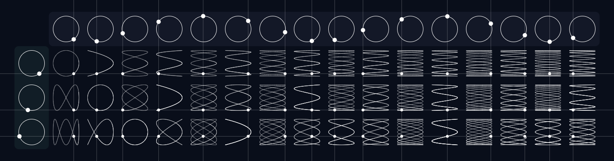

<h1 align="center">
    Lissajous Curve Table
</h1>

    Website to visualize Lissajous curves in 2D!

  

## Content Table

- [Description](#description)
- [Preview](#preview)
- [Screenshot](#screenshot)
- [License](#license)
- [Contact](#contact)

## Description

This project is a website to visualize Lissajous curves in 2D, through the combination of circular movements in two perpendicular directions with different speeds.

## Preview

🔗 [Lissajous Curve Table - Preview](https://victor101106.github.io/Lissajous-Curve-Table/)

## Screenshot

## License

Distributed under the MIT license. See [LICENSE](LICENSE.md) for more information.

## Contact

Victor Gabriel • [Github](https://github.com/Victor101106/) • victorgabriel101106+github@gmail.com
